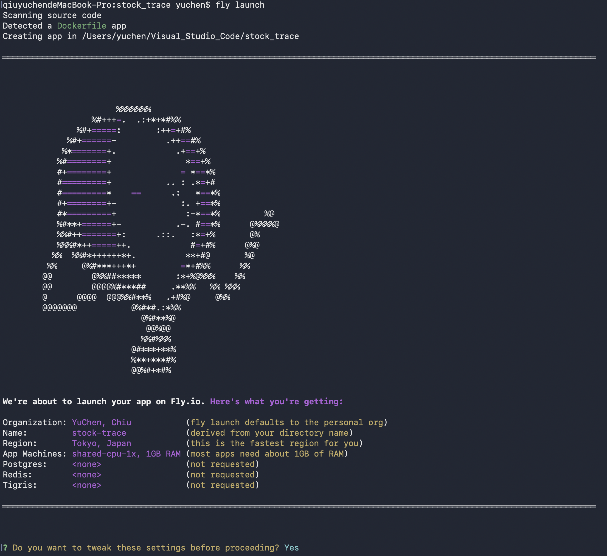

# Welcome
This project aims to build a custom stock tracking website.

## Website Demo
https://github.com/user-attachments/assets/3329020c-a45e-42ed-b660-f5ea3cc8a02f


## Project Learnings

1. Use `startup.sh` with `Dockerfile` to run three tasks in one container
    1. Cron service: Daily update data.
    2. Flask API: As backend server.
    3. Streamlit UI: As fronend web.

### Deploy on Fly.io by DockerFile
1. Install **Flyctl** CMD tool with `brew install flyctl`
2. Login in Fly.io with `fly auth login`
3. Establish `startup.sh`, `Dockerfile` and `.dockerignore` in project root
4. **First** init config and deploy with `fly launch`
5. After Fly.io detects Dockerfile, we have to make sure the config and input `y` for Yes
    
6. **The following** update and deploy with `fly deploy --no-cache`


### Fly.io Deploy and Update Command

#### 1. Init and Deploy for the first time
> Execute after preparing `Dockerfile`、`startup.sh` and repo files

*   **`fly launch`**：Scan project rool and initialize App。 Generate `fly.toml` config after execution
*   **`fly volumes create stock_storage --region nrt --count 1 --size 1`**
    * `--count 1`： Establish two volumes
    * `--region nrt`: set the region on Tokyo
    * example: `fly volumes create stock_storage --region nrt --count 1 --size 1`

#### 2. Update and Re-Deploy for the following time
> Execute after every when modify and codes in the repo

*   **`fly deploy`**：Deploy a new version again based on `fly.toml`
*   **`fly deploy --no-cache`**：Same as above but without past cache

#### 3. Monitoring and Logger

*   **`fly logs`**：Check logger in the container
*   **`fly status`**：Check the status of the working machines
*   **`fly open`**：Automatically open the app in browser
*   **`fly machine stop --app <app name>`**: Suspend the app
*   **`fly machine stop --app <app name>`**: Delete the app

#### 4. Source Management
*   **`fly m list`** (Virtual Machines List)：List all running virtual machine entities
*   **`fly m restart <ID>`**：Manually restart a specific virtual machine entity

#### 5. Key files for deployment
| File Name | Key Point | 目的 |
| :--- | :--- | :--- |
| **`fly.toml`** | 包含 `[mounts]` 與兩組 `[[services]]` | 確保資料持久化並開放 80 (UI) 與 5001 (API) 埠口|
| **`startup.sh`** | 加上 `--server.address=0.0.0.0` | 解決 `refused connection` 警告，讓外網可存取 |
| **`Dockerfile`** | 使用 `FROM python:3.13-slim` | 與你目前的開發環境版本保持一致|
| **`.dockerignore`** | 排除 `.venv` 與 `.git` | 縮小上傳體積，避免過多的無效傳輸|

#### 6. fly.toml 的撰寫說明
- `app = 'stock-trace'` -> 設定 app name
- `primary_region = 'nrt'` -> 設定伺服器定區
- `min_machines_running = 1` -> 確保至少有一個 machine 工作，避免睡著
- `[[services]]`
    - `[http_service]` -> 屬於快捷語法，會在底層產生一個完整的 [[services]] 
- `processes = ["app"] ` -> 指定這個服務或埠口對外開放時要套用到哪一個進程群組（Process Group）上
    - 同一個專案可以把不同的工作拆成多個容器（VM）來跑，這時候就可以定義多個 processes。
        - 一個負責網頁前端 (web)
        - 一個負責後端 API (api)
        - 一個負責背景定時任務 (worker)
- example
    ```yaml
    app = 'stock-trace'            
    primary_region = 'nrt'         

    [build]


    [env]
    TZ = 'Asia/Taipei'

    [http_service]                  
    internal_port = 8501          
    force_https = true
    auto_stop_machines = 'stop'
    auto_start_machines = true
    min_machines_running = 1      
    processes = ['app']

    [[services]]
    protocol = 'tcp'
    internal_port = 5001
    auto_stop_machines = 'stop'
    auto_start_machines = true
    min_machines_running = 1     
    processes = ["app"]

    [[services.ports]]
        port = 5001
        handlers = ["http"]


    [[vm]]
    memory = '1gb'
    cpu_kind = 'shared'
    cpus = 4
    memory_mb = 1024
    ```
